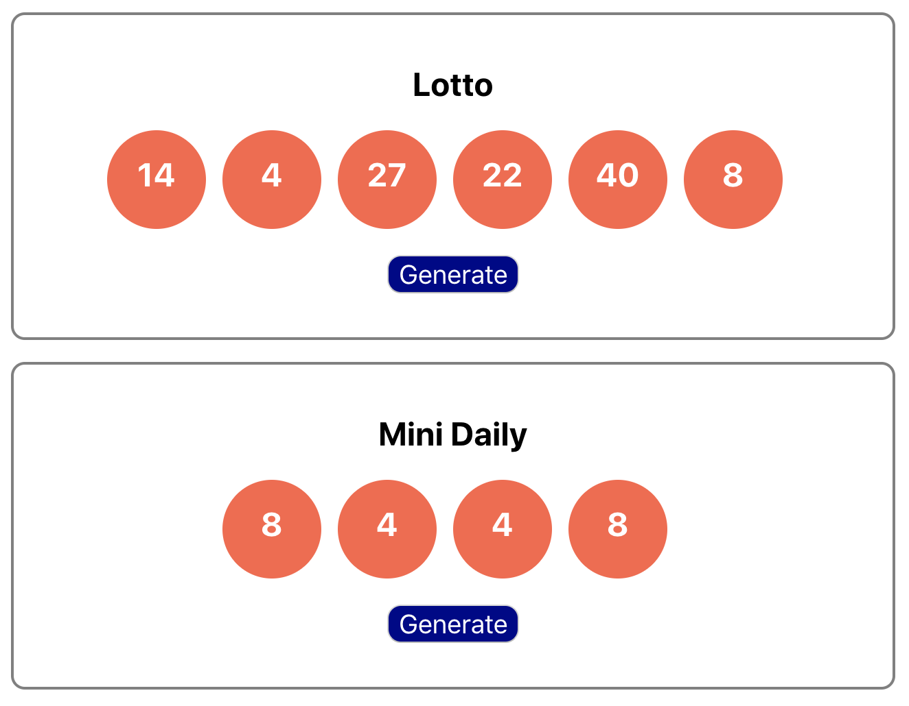

# React State Patterns

## Goals

Learn how to update state based off of existing state
Properly manage state updates for mutable data structures
Discuss best practices for modeling state and designing components

### Example Design: Lottery

Let’s Design an App!


in App.js

- Should show 6 balls

- Value 1-40 generated when button clicked

- Should Be Reusable, Flexible


in App.js

```html
<div>
  <Lottery />
  <Lottery title="Mini Daily" numBalls={4} maxNum={10} />
</div>
```

Should be able to control title, num balls to show, and max value

### Lottery Component

- Props
  
> title: title of the lottery
> numBalls: num of balls to display
> maxNum: max value of ball
State
> nums: array of [num, num, num, ...] for balls

- Events
  
>onClick: regenerate nums in state


### LotteryBall Component

- Props
  
> num: value on this ball

> State: none!
> Events: none!

### Setting State Using State

We’ve established that setState() is asynchronous…

So: it’s risky to assume previous call has finished when you call it. Also, React will sometimes batch (squash together) calls to setState together into one for performance reasons.

If a call to setState() depends on current state, the safest thing is to use the alternate “callback form”.

### setState Callback Form
```js
this.setState(callback)
```

Instead of passing an object, pass it a callback with the current state as a parameter.

The callback should return an object representing the new state.

```js
this.setState(curState => ({ count: curState.count + 1 }));
```

### Abstracting State Updates

The fact that you can pass a function to this.setState lends itself nicely to a more advanced pattern called functional setState.

Basically you can describe your state updates abstractly as separate functions. But why would you do this?

```js
// elsewhere in the code
function incrementCounter(prevState) {
  return { count: prevState.count + 1 };
}
// somewhere in the component
this.setState(incrementCounter);
//Because testing your state changes is as simple as testing a plain function:

expect(incrementCounter({ count: 0 })).toEqual({ count: 1 });
```
This pattern also comes up all the time in Redux!

### (Advanced) Functional setState

Here is a nice opinionated article on the subject of using functional setState: [functional setState](https://medium.freecodecamp.org/functional-setstate-is-the-future-of-react-374f30401b6b)


You have to be extra careful modifying your array of objects!

```js
completeTodo(id) {
  const theTodo = this.state.todos.find(t => t.id === id);
  theTodo.done = true; // NOOOOO

  this.setState({
    todos: this.state.todos // bad
  });
}
```
Why? It’s a long story…

Mutating nested data structures in your state can cause problems w/ React. (A lot of the time it’ll be fine, but that doesn’t matter. Just don’t do it!)

### Immutable State Updates

A much better way is to make a new copy of the data structure in question. We can use any pure function to do this…

```js
completeTodo(id) {

  // Array.prototype.map returns a new array
  const newTodos = this.state.todos.map(todo => {
    if (todo.id === id) {
      // make a copy of the todo object with done -> true
      return { ...todo, done: true };
    }
    return todo;  // old todos can pass through
  });

  this.setState({
    todos: newTodos // setState to the new array
  });
}
```

Pure functions such as .map, .filter, and .reduce are your friends. So is the …spread operator.

There is a slight efficiency cost due to the O(N) space/time required to make a copy, but it’s almost always worth it to ensure that your app doesn’t have extremely difficult to detect bugs due to mischevious side effects.

### Immutable State Summary
While it sounds like an oxymoron, immutable state just means that there is an old state object and a new state object that are both snapshots in time.
The safest way to update state is to make a copy of it, and then call this.setState with the new copy.
This pattern is a good habit to get into for React apps and required for using Redux.
Designing State
Designing the state of a React application (or any modern web app) is a challenging skill! It takes practice and time!

